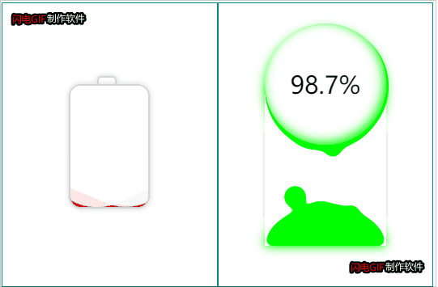

# BatteryCharge
使用CSS和JS实现安卓手机两种常见的充电特效，多次打磨，有需要的小伙伴可以看看。

**基于CSS3，暂未考虑浏览器兼容问题**。

[点击这里预览](http://projects.biubiubius.com/BatteryCharge/index.html)

CSS使用Less编译（或许你会因此爱上写CSS）。两块电池的实现效果原理文章中有讲到，我主要说说关于第二块圆形电池的想法。

圆形电池里面的小圆点是通过JS动态创建并插入，并使用Math.random()计算随机位置和半径大小。
其实我有想过作者的想法，使用纯CSS可以事先画好一定数量的圆点，按照一定的先后顺序错开运动，也可以实现。
我只是单纯想练习一下自己的动画能力。通过Circle类描述圆点的属性，通过Run类控制圆点的创建，插入，删除，运动等。

这里，顺便推荐一个好用的，不依赖jQuery的动画库[Velocity.js](http://shouce.jb51.net/velocity/feature.html)
我比较喜欢他的一个特点，每一个动画都会返回一个Promise对象，在某些情况下涉及异步流程控制的时候，确实很好用

# 参考
[【掘金】CSS动画？教你使用障眼法，打造炫酷充电效果](https://juejin.im/post/5e1aa013f265da3e2c246ca3)

文章全部使用CSS实现，但个人加入的自己的想法，部分功能采用JS实现。

# GIF

